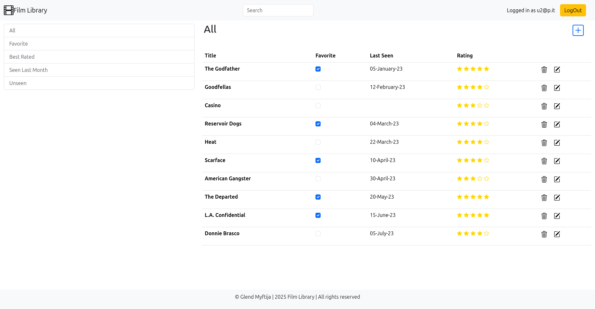
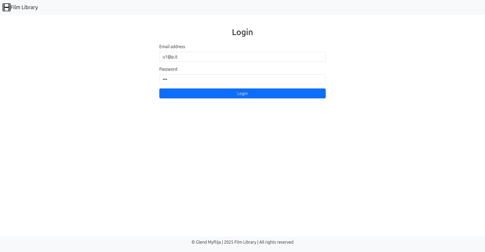

# Film Library Web Application

A web application for managing and exploring your film collection. The Film Library lets users log in, view their films, add new films, edit/delete existing films, and filter the list by various criteria (favorites, best rated, unseen, etc.). It also features live search filtering as you type.

## Features

- **User Authentication:**  
  Users can log in and log out. User-specific film data is fetched once authenticated.
  
- **Film Management:**  
  - View a list of films associated with the logged-in user.
  - Add a new film.
  - Edit or delete an existing film.
  
- **Filtering and Search:**  
  - Easily filter films by category (e.g., favorites, best rated, seen last month, unseen).
  - Live search filtering that updates the film list as you type.
  
- **Responsive UI:**  
  Built with React and React-Bootstrap, the UI adapts to various screen sizes.

## Technologies Used

### Frontend

- **React** – A JavaScript library for building user interfaces.
- **Vite** – A fast frontend build tool.
- **React Router** – For client-side routing.
- **React-Bootstrap & Bootstrap Icons** – For a responsive UI and icons.

### Backend

- **Node.js & Express** – Server environment and web framework.
- **SQLite** – Lightweight relational database.
- **Passport** – For user authentication (with Passport Local Strategy).
- **Express-session, Cors, Morgan, and express-validator** – For session management, CORS support, logging, and input validation.


### Installation

1. **Clone the repository:**

   ```bash
   git clone https://github.com/gl3nd/film-library.git
   cd film-library

2. **Open the project in VSCode**

3. **Open two new Terminals in VSCode**

4. **Terminal 1 (Server)**
    ```bash
    cd server/
    npm install
    nodemon index.js

5. **Terminal 2 (Client)**
    ```bash
    cd client/
    npm install
    npm run dev


### Use these steps to set up and run the Film Library Web Application. Happy coding!

### Example

### In the database there are already 3 users
    
    username: u1@p.it
    password: pwd
    
    username: u2@p.it
    password: pwd

    username: u3@p.it
    password: pwd






